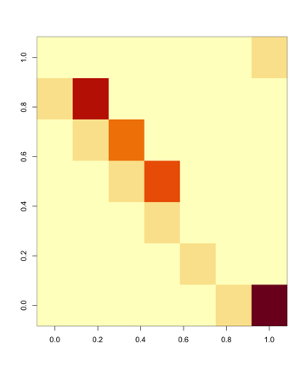

```{r setwd, include=FALSE}
setwd("~/OneDrive - University of North Carolina at Chapel Hill/BIOL564/lab03")
```

```{r Packages, include=FALSE}
library(reshape2)
library(ggplot2)
library(primer)
library(deSolve)
```

```{r DemoInfo() fn, include=FALSE}
`DemoInfo` <-
function (mat) 
{
    eigs.mat <- eigen(mat)
    dom.pos <- which.max(abs(eigs.mat$values))
    L1 <- Re(eigs.mat$values[dom.pos])
    w.tmp <- eigs.mat$vectors[, dom.pos]
    w <- Re(w.tmp/sum(w.tmp))
    v.tmp <- eigen(t(mat))$vectors[, dom.pos]
    v <- Re(v.tmp/v.tmp[1])
    sens <- (v %*% t(w))/as.numeric(v %*% w)
    elas <- (mat/L1) * sens
    return(list(lambda = L1, SSD = w, RV = v, Sensitivities = sens, 
        Elasticities = elas, PPM = mat))
}
```

------------------------------------------------------------------------

# Exercise 1: Stage-Structured Population

## a.

-   The arrows in between different development stages is the probability that an individual will make it to the next stage of development, represented by p values. The fecundity in the arrows backwards motion represents the births being added.

## b.

### Stage 1

$$ N_1(t+1) = f_3N_3+f_4N_4$$

### Stage 2

$$ N_2(t+1)=p_{21}N_1 $$

### Stage 3

$$ N_3(t+1)=p_{32}N_2 $$

### Stage 4

$$ N_4(t+1)=p_{43}N_3+p_{44}N_4 $$

## c.

-   The population consists of four stages (N1, N2, N3, and N4). Individuals transition between stages based on fixed probabilities (e.g., survival and transition rates). New individuals are recruited into N1 from reproduction in later stages (N3 and N4). The number of individuals in each stage at time t+1 depends on the previous stage's population at time t. N1 is replenished by reproduction from N3 and N4. N2, N3, and N4 follow survival and transition rates to move to the next stage.

```{r Initials}
# Population sizes over time:
# N[i, t] is the population size of stage i at time t
# 4 stages, 10 timesteps
N <- matrix(0, nrow = 4, ncol = 40, dimnames = list(c('N1', 'N2', 'N3', 'N4'), c(1:40)))
# Initial population sizes: N1 = 10, N2 = 1, N3 = 1, N4 = 1
N[1, 1] <- 10
N[2, 1] <- 1
N[3, 1] <- 1
N[4, 1] <- 1
```

```{r Num Individuals}
N[1, 2] <- 3*N[3, 1]+12*N[4,1]
N[2, 2] <- 0.1*N[1,1]
N[3, 2] <- 0.8*N[2,1]
N[4, 2] <- 0.8*N[3,1]+0.1*N[4,1]
```

## d.

```{r d. Loop over Time}
for (t in 2:39) {
N[1, t+1] <- 3*N[3, t]+12*N[4,t]
N[2, t+1] <- 0.1*N[1,t]
N[3, t+1] <- 0.8*N[2,t]
N[4, t+1] <- 0.8*N[3,t]+0.1*N[4,t]
}
```

-   The loop updates the population structure at each time step based on survival probabilities and reproduction. Individuals transition between stages or remain in the same stage. At each step, a proportion of individuals moves to the next stage. Stages 3 and 4 contribute offspring to Stage 1 (f3=3, f4=12), simulating new individuals entering the population. Over multiple iterations, this models the population's growth and distribution across stages over time, and tells us whether the population stabilizes, grows, or declines.

```{r d. ggplot2}
x <- melt(t(N))
colnames(x) <- c('t', 'Stage', 'PopSize')

ggplot(x, aes(x = t, y = PopSize, color = Stage)) +
geom_line() + geom_point()
```

-   N1 (red line) grows rapidly over time, showing a clear increasing trend. N2, N3, and N4 (green, blue, purple) remain relatively stable and much smaller in population size. The results indicate that reproduction from later stages drives population growth. Plot shows the sharp increase in N1, driven by reproduction and the stable or slowly increasing populations in N2, N3, and N4.

------------------------------------------------------------------------

# Exercise 2: Total Population Size and Growth Rate

###### Calculating the changes in total population size over time.

```{r Popsize/Time}
N_total <- colSums(N)
# Plotting
x <- data.frame(t = seq_along(N_total), N_total)

ggplot(x, aes(x = t, y = N_total)) +
geom_point() + geom_line()
```

-   This plot sums the population sizes across all four stages at each time step.The total population is increasing over time, though there is some initial fluctuation. This suggests that reproduction is contributing to long-term population growth.

## a.

###### Calculate the growth rate at each time step.

```{r loop growth rate}
lambda <- numeric(39)
for (t in 1:39) {
lambda[t] <- N_total[t+1]/N_total[t]
}
```

```{r a. ggplot}
x <- data.frame(t = seq_along(lambda), lambda)

ggplot(x, aes(x = t, y = lambda)) +
geom_point() + geom_line()
```

-   At early time steps, lambda varies significantly, even going above 1.1 and below 0.8, indicating instability in population dynamics. After about t = 10, the growth rate stabilizes around lambda = 1, meaning the population size is growing at a roughly constant rate. This behavior suggests the system is approaching a stable distribution, where each stage's proportion is relatively constant.

```{r datatablegrowthrate}
data.frame(lambda)
```

-   This suggests instability in population growth at the beginning, likely due to the initial stage structure not being at equilibrium. There are some values above 1.0 and some below 1.0 where the population is fluctuating between population growth and decline. The alternating pattern suggests the population is fluctuating dynamically rather than immediately stabilizing. Since a lot of the values are near 1.0, the population is closer to stability. This trend seen between the predictive models and actual values show that initial fluctuations occur before stabilizing/long term patterns.

------------------------------------------------------------------------

# Exercise 3: Stage Distribution Over Time

###### Looking at how the stage distribution, the fraction of the total population occupied by different stages, changes over time.

```{r}
x <- apply(N, 1, function(x) x / N_total)
x <- melt(x)
colnames(x) <- c('t', 'Stage', 'PopFraction')

ggplot(x, aes(x = t, y = PopFraction, color = Stage)) +
geom_point() + geom_line() + ylim(c(0,1))
```

-   This plot shows the fraction of the total population that belongs to each stage over time. N1 (red line) dominates, consistently making up about 80% of the total population. The other stages (N2,N3,N4) remain at relatively low proportions (5-8%). After some early fluctuations, the proportions stabilize around their final values. This suggests that most of the population remains in the first stage, likely due to high reproduction rates or slow transitions to later stages. The population has reached a stable stage distribution, in which each stage maintains a consistent fraction of the total.

## a.

###### Looking at the numerical values of the stage distribution at $$ t=40 $$

```{r values}
melt(N[, 40])
```

-   These values represent how many individuals are in each stage at t=40. It tells us the actual size of the population in each stage. The total population is still growing, but most individuals are concentrated in the earlier stages (N1).

###### Examining the proportion of individuals in each stage distribution at $$ t=40 $$

```{r proportions}
melt(N[,40]/sum(N[,40]))
```

-   Where the stable stage distribution has been reached, where these percentages remain consistent over time. N1 is dominating indicating high recruitment in early stages. Later stages remain small, which could mean low survival rates or slow transition between stages.

------------------------------------------------------------------------

# Exercise 4: Matrix and Eigenvalue Analysis

###### Converting the system of equations to matrix form.

## a.

```{r newentry}
A <- matrix(0, nrow = 4, ncol = 4)
A[1,3] <- 3 # fecundity stage 3 to stage 1
A[1,4] <- 12 # fecundity stage 4 to stage 1
A[2,1] <- 0.1 # survivorship from stage 1 to stage 2
A[3,2] <- 0.8 # survivorship from stage 2 to stage 3
A[4,3] <- 0.8 # survivorship from stage 3 to stage 4
A[4,4] <- 0.1 # survivorship from stage 4 to stage 4
A
```

-   Matrix A represents how individuals transition between stages over time. Each row describes how the population in a given stage is impacted by other stages in the previous timestep. Top row (fecundity): new individuals (Stage 1) are recruited from Stage 3 (3 offspring per individual) and Stage 4 (12 offspring per individual). The diagonal elements represent the survivorship of individuals progressing through the stages. This shows us where individuals are reproducing and transitions happen.

```{r eigenvaluescalc}
eigenValsVecs <- eigen(A)
eigenValsVecs
```

$$ \lambda_1 = 1.0233637 $$ $$ \lambda_2 = -0.0443153+0.9321965i $$ $$ \lambda_3 = -0.0443153-0.9321965i $$ $$ \lambda_4 = -0.8347331 $$

-   The largest eigenvalue is 1.023, which represents the long term growth rate of the population (lambda1). Since lambda1\>1, the population is growing over time. If lambda1\<1, the population would decline.

## b.

-   The largest eigenvalue, 1.023, represents the asymptotic growth rate (lambda) of the population. Since lambda\>1, the population will increase over time at a stable rate. In exercise 2, we calculated the growth rate at each time step, which gave us fluctuating lambda over time. lambda fluctuated so much initially in exercise 2 because the population had not reached its stable condition. lambda stabilized around at about 1.023!

```{r scale eigenvector}
Re(eigenValsVecs$vectors[, 1] / sum(eigenValsVecs$vectors[, 1]))
```

## c.

-   The eigenvectors are related to the eigenvalues and represent the stable stage structure of the population. After scaling the eigenvector to one, we can see that the distribution is as follows: [80.6%, 7.8%, 6.2%, 5.4%]. This is what we noticed from the plot in Exercise 3 where N1 (the red line) made up about 80% of the population. We can infer that in the long run, the population will settle into these kind of stage proportions regardless of the initial population structure. If the initial population size were to be increased, the ratios would remain constant still.
-   So, the eigenvector corresponding to the largest eigenvalue represents the stable stage structure of the population. We see long term stabilizing trends in these populations regardless of initial conditions.

------------------------------------------------------------------------

# Exercise 5: Loggerhead Sea Turtle Population Model

###### Analyzing a Lefkovitch matrix model for a stage-structured population of loggerhead sea turtles. Determine whether the population is increasing or decreasing and to explore how protecting eggs would impact the population.

## a.

```{r PopulateMatrix}
P <- matrix(0, nrow = 7, ncol = 7)
P[1, 5:7] <- c(127, 4, 80)
P[2, 1:2] <- c(0.6747, 0.7370)
P[3, 2:3] <- c(0.0486, 0.6610)
P[4, 3:4] <- c(0.0147, 0.6907)
P[5, 4] <- 0.0518
P[6, 5] <- 0.8091
P[7, 6:7] <- c(0.8091, 0.8089)

DemoInfo(P)
```



## b. Eigenvalue Analysis

```{r eigenvector}
eigen(P)
```

$$ \lambda_1 = 0.945 $$

-   The largest eigenvalue, 0.945, represents the long-term growth rate of the population. Since lambda1\<1, the population is declining over time. This also means that fewer are replacing the ones that die. Over time, the population will shrink unless efforts are made to reverse the trend. This aligns with findings of Crouse et al. (1987) that loggerhead populations were shrinking due to the high mortality rates in juvenile stages.

## c. Egg Survival

-   If conservation efforts were made to protect the eggs, it would most likely affect the transition probability from eggs to small juveniles. In matrix P, we would increase the first nonsero value in the first row (P[2,1]) because this represents survival from eggs to small juveniles. If the transition probability increased to 1, essentially 100% survivorship of the eggs successfully hatching, the population growth rate would increase.

------------------------------------------------------------------------

# Exercise 6: Displaying Sensitivity and Elasticity

```{r elasticity matrix}
x <- DemoInfo(P)$Elasticities
image(t(x)[, 7:1])
```

-   This visualization helps to show which life stage transition has the greatest affect on the overall population growth. Darker values are associated with higher elasticity, which also means that those transitions have a larger effect on the population growth when altered.

## a.


(i) Increasing Fecundity: In analyzing the reproductive output, low elasticity in the fecundity portions are represented by the top row of the matrix. We find that increasing birth rates has little impact on population growth.


(ii) Increasing Transition Probabilities Between Life Stages: The middle diagonal elements of the matrix represent transition rates between the life stages. We find that some of the elements are elastic which mean that conservation efforts made towards improving transitions help population growth in this population.


(iii) Increasing Survival Probabilities Within Life Stages: We find that the darkest colors are along the diagonal, which suggests that increasing the survival probabilities within a stage will have the greatest impact on population growth. This will be the most effective conseration strategy for recovery of these populations.

## b.


(i) The best conservation investment strategy would be to increase survivorship of juveniles and sub-adults because this is where the turtles are most vulnerable. An example of this could be minimizing predation and human disturbances in juvenile areas or protecting juvenile habitats where they grow before becoming an adult.


(ii) The most wasteful conservation investment strategy would be focusing on protecting eggs because this has shown to have little effect on population recovery. We found that even if all of the eggs survive, most of the turtles die in the juvenile stage before reproducing. It would also be a waste to release hatchlings from conservation hatcheries without making sure they have survived the juvenile stage.
